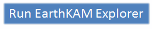
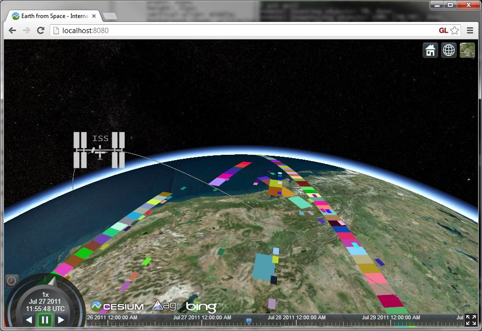
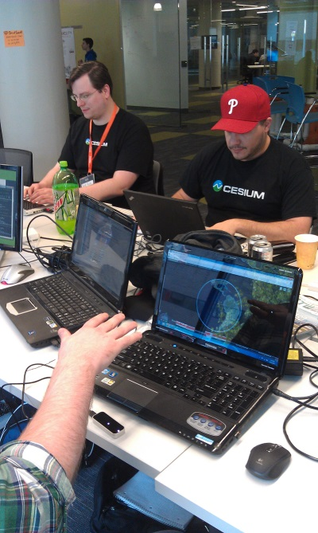

EarthKAM Explorer
=================

Use <a href="http://www.google.com/chrome/" target="_blank">Chrome</a> or <a href="http://www.mozilla.org/en-US/firefox/new/" target="_blank">Firefox</a> to run EarthKAM Explorer:

EarthKAM Explorer solves the <a href="http://spaceappschallenge.org/challenge/earth-from-space/" target="_blank">Earth from Space</a> challenge for the [International Space Apps Challenge 2013](http://spaceappschallenge.org/).  EarthKAM Explorer provides web-based 3D exploration of satellite images taken by middle school students through the <a href="https://earthkam.ucsd.edu/" target="_blank">ISS EarthKAM</a> program.

EarthKAM Explorer is written using JavaScript and <a href="http://cesium.agi.com/" target="_blank">Cesium</a>, an open-source WebGL virtual globe and map, so it runs in a browser with an requiring a plugin.  EarthKAM Explorer support the <a href="https://www.leapmotion.com/" target="_blank">Leap Motion</a> controller for hand-gesture input as shown below.

EarthKAM Explorer was created in a weekend by developers from <a href="http://www.agi.com/" target="_blank">Analytical Graphics, Inc</a>: <a href="https://github.com/bagnell" target="_blank">@bagnell</a>, <a href="https://github.com/hpinkos" target="_blank">@hpinkos</a>, <a href="https://twitter.com/matt_amato" target="_blank">@mramato</a>, <a href="https://twitter.com/pjcozzi" target="_blank">@pjcozzi</a>, and <a href="https://github.com/shunter" target="_blank">@shunter</a>.

Building EarthKAM Explorer
--------------------------
* Clone this repo.
* Install [NodeJS](http://nodejs.org/)
* From the `server` folder, run `node server.js`.
* Browse to [http://localhost:8080](http://localhost:8080)

Resources
---------
* [Earth from Space challenge details](http://spaceappschallenge.org/challenge/earth-from-space/) on the Space Apps site.
* [EarthKAM Explorer project page](http://spaceappschallenge.org/project/earthkam-explorer/) on the Space Apps site.
* [ISS EarthKAM Gallery](http://images.earthkam.ucsd.edu/main.php)
* [ISS EarthKAM csv downloads](https://earthkam.ucsd.edu/ek-images/data)
* [Cesium Documentation](http://cesium.agi.com/Cesium/Build/Documentation/)
